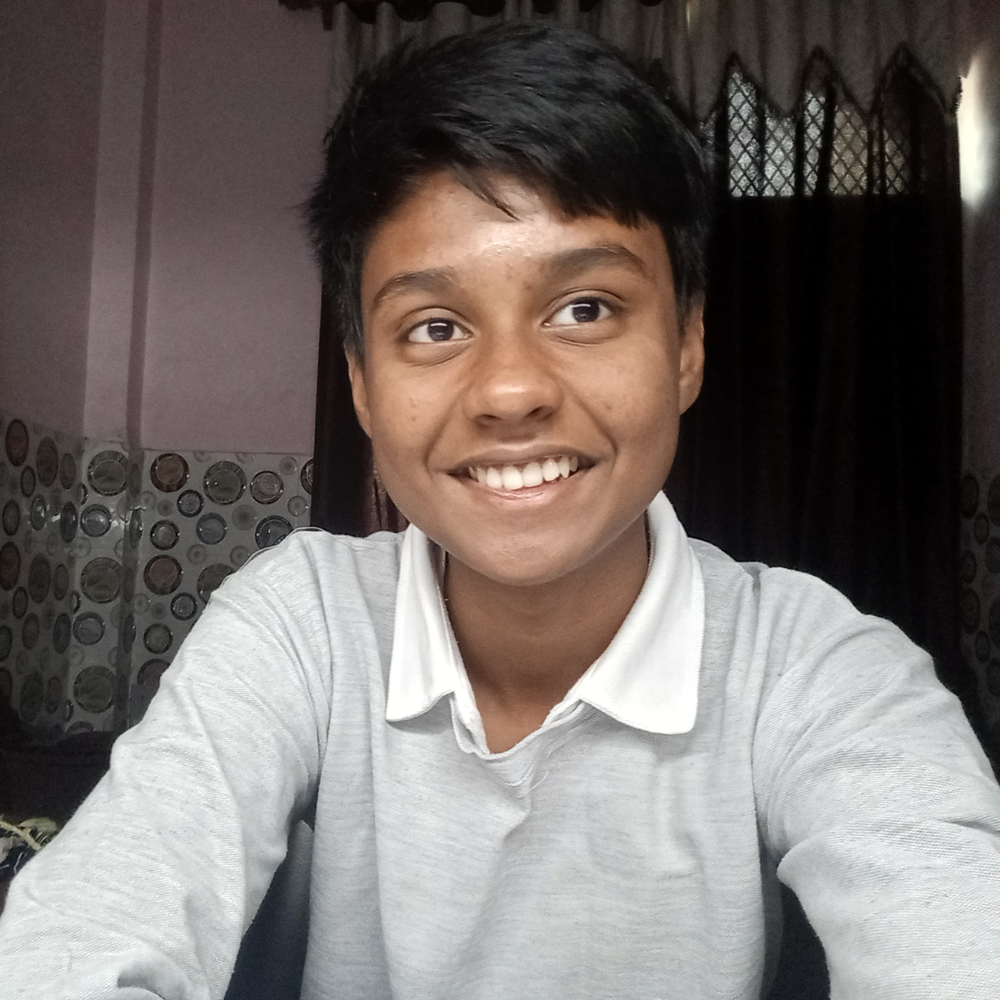

# You weren’t supposed to land here.

And yet, here you are — reading words I wrote in silence, probably without ever meeting me. That, in itself, is poetic.  
I didn’t build this page to impress. I built it to express — not who I am in bullet points, but in presence.  
This readme isn’t a pitch deck or a personal ad. It’s a door left slightly open, for the kind of minds that like wandering into rooms uninvited.

---

I start early. Always have.  
I never waited for permission. While most people followed maps handed to them, I trusted something quieter — my own gut.  
That still voice inside me that whispered, “Try it now. Build it now. Learn it now.”  
Even when nothing made sense, I listened.  
And it led me to places no curriculum ever mentioned.

---

I don’t think in terms of “career plans” or “exit strategies.”  
I think in ideas. And when one grabs me — really grabs me — I follow it.  
I’ve always believed that the best things come from impulse wrapped in intention.  
That’s how this site was born too.

---

This isn’t a pitch. It’s a reflection.  
I wasn’t sure what to write here.  
So I did what I always do when I’m unsure:  
I stared at the blank page until it stopped staring back.  
Then I wrote this.

No elevator pitch. No bullet points. No pretending I know more than I do.  
Just this: I’m someone who thinks a lot — sometimes too much — about the gap between what we say and what we mean.  
About how often we speak in punchlines when what we really need are pauses.

---

Everyone’s busy performing. I get it. That’s how the game works.  
But what if we stopped?  
What if — just for a second — we stopped trying to be impressive and started being honest?

---

This isn’t a portfolio. It’s a page.  
Not a statement of purpose — more like a glitch in the system.  
A moment to say: *Hey. I’m here. And I think. And I care.*

If you’re reading this, maybe it wasn’t meant for you.  
But maybe that’s exactly why you **should** be reading it.

So no, this isn’t a pitch.  
It’s something quieter. Maybe even something real.

---

**Calm over chaos. Depth over noise.**  
I’m not interested in fast money, fast fame, or fast anything, really.  
I value silence. Clarity. A cup of coffee that’s not rushed.  
I believe there’s more power in one thoughtful project than in ten shallow ones.  
I’d rather go unnoticed building something real than go viral for building nothing.

And I mean this sincerely — if your project is bold, thoughtful, and rooted in real change, I’ll show up.  
Even if you can’t pay.  
Because the kind of impact I want to make can’t be measured in bank transfers.  
Not everything I do has to be monetized. Some things just have to be **meaningful**.

---

I’m not looking for everyone. Just the right few.  
I don’t want thousands of followers. I want quiet collaborators.  
People who think deeply, obsess slowly, and dream in tangents.  
People who look at broken systems and feel a moral itch to fix them — not because it pays well, but because it **matters**.

---

If you’re someone who writes before they speak…  
Who builds late into the night not for deadlines, but for dopamine…  
If you’ve ever been called “too intense,” “too idealistic,” or “too curious” — then we’re already on the same frequency.

---

When you leave, I want you to wonder.  
Not about what I do. That’s in the other tabs.  
But about who I am.

I hope this page doesn’t give you closure.  
I hope it gives you questions.  
Like — “Why does this feel familiar?”  
Or “Who even writes like this anymore?”

And maybe, if the curiosity lingers long enough, you’ll reach out.

---

## I know you’re curious

Let’s have a nice talk — no agendas, no expectations.  
Just a 15-minute virtual tea break, the kind where ideas flow freely and nobody rushes the moment.  
**Book a slot here:** [calendly.com/aryanbrite/30min](https://calendly.com/aryanbrite/30min)

---

Until then, this corner of the internet will wait quietly.  
Like a book on a shelf you didn’t expect to love — but did.

---

---

## My Timeline

A life in phases — each one a chapter, not a checklist. Here's how it's unfolded so far:

### Phase 1 — High School (2024–2026)

- Finished middle school with a 3.7/4.0 CGPA — solid, not groundbreaking, but it left me hopeful. With an eager mind and a restless heart, I stepped into high school, choosing Science as my major. It felt less like a decision, more like a quiet dare to myself.

- Before high school formally began, I wandered — through content writing, e-commerce trials, marketing misadventures, and even fellowship applications. None bore fruit. But each failure whispered a different lesson, and I was listening.

- I stumbled into open-source like one discovers a hidden alley in a busy city — by accident, but never by mistake. I launched my first public projects, contributed on GitHub, and started leaving footprints in a digital world where age, location, and labels didn’t matter.

- Class 11 arrived with its own storm. My grades dipped to a 2.6/4.0 CGPA — but strangely, I wasn’t shaken. That year taught me to uncouple academic metrics from personal growth. Not everything that counts can be counted.

- Amid the chaos, I authored *Zero to Job*, a student’s guide to exploring IT careers. It began as a monetization idea, ended as a near-free resource tucked in a quiet corner of the internet. Sometimes, impact matters more than income.

- After many average experiments, one idea finally clicked — a quiet breakthrough, born from boredom and curiosity. I got 2.5 million streams on a song i posted randomly.

- The start of Class 12 was beautifully unproductive. For two months, I didn’t study a word. Instead, I caught feelings for a girl who never looked back. (“psst… she never even noticed”)

- Eventually, I joined HackClub — a place that felt like home for builders and dreamers. Collaborated with strangers who became friends. Built things that didn’t just work — they sparked something inside me.

<em>Last updated: June 29, 2025</em>

### 🛠️ Phase 2 — [Next Chapter Title]
*Coming soon…*

